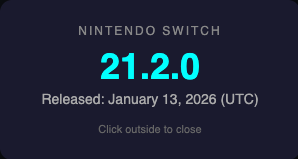

# Switch Firmware Checker

A browser bookmarklet that fetches the latest Nintendo Switch system firmware version from [switchbrew.org](https://switchbrew.org/wiki/System_Versions).

## Usage

### Option A: Open the HTML page

1. Open https://wayne45.github.io/switch-firmware-checker/
2. Drag the green **"Switch FW Version"** button to your bookmarks bar.

### Option B: Manual bookmark

1. Create a new bookmark in your browser
2. Set the name to `Switch FW Version`
3. Paste the contents of `bookmarklet.js` as the URL

Click the bookmark from any page to see the latest Switch firmware version in a popup overlay.

> **Note:** The bookmarklet may show a "Failed to fetch" error on sites with strict Content Security Policy (CSP) headers, such as github.com and twitter.com. These sites restrict outgoing requests to whitelisted domains only. As a workaround, use the bookmarklet on a simple page (e.g. `about:blank`) or visit the [hosted page](https://wayne45.github.io/switch-firmware-checker/) directly.

## How it works

- Uses the switchbrew.org MediaWiki API with CORS support (`origin=*`)
- Parses the System Versions table to extract the latest firmware version and release date
- Displays the result as an overlay on the current page

## Data source

https://switchbrew.org/w/index.php?title=System_Versions&mobileaction=toggle_view_desktop
